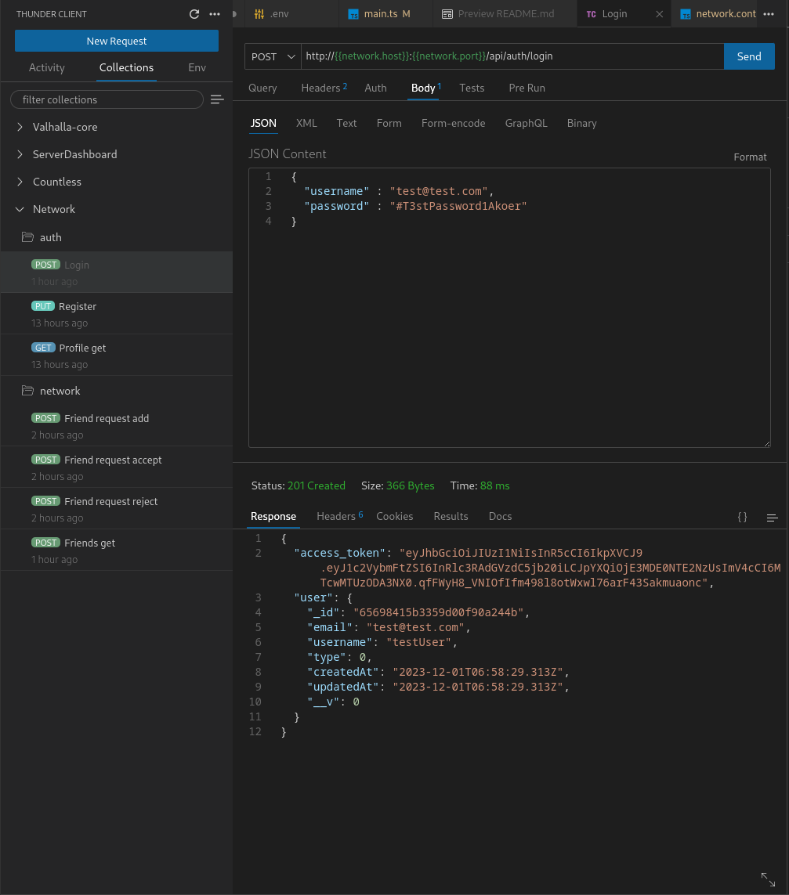

## Description

A social media app that allows users to follow each other and post messages. The app is built using NestJS, MongoDB, Bulljs, and Redis.

This project is part of a coding challenge for a job interview and is not intended for production use, many features are missing due to time constraints.

## Installation

```bash
$ npm install
```

# Setting environment variables 
This project uses environment variables to configure the database connection, encryption, and other settings. The environment variables are stored in two .env files,
the docker stack will use the .env file in the docker directory, and the app will use the .env file in the root directory.

## Docker .env file
```.env
MONGO_ADMIN_USERNAME=a username for the mongo admin user (e.g. mongo)
MONGO_ADMIN_PASSWORD=aSecurePasswordForMongoAdmin
MONGO_ADMIN_SERVER=admin-server-name (e.g mongodb)
IP_MONGODB=your-mongo-ip (e.g. 172.29.0.12) 
MASK_MONGODB=mongo-mask (e.g 172.29.0.0/16)
PORT_MONGODB_HOST=your-port (e.g. 27017)
PORT_MONGODB_CONTAINER=27017
MONGO_DATA_VOLUME_PATH_HOST=your-path/mongo-data
MONGO_DATA_VOLUME_PATH_CONTAINER=/data/db

REDIS_PASSWORD=aSecurePasswordForRedis
REDIS_LOG_LEVEL=warning
REDIS_PORT_HOST=your-port (e.g. 6379)
REDIS_PORT_CONTAINER=6379
REDIS_DATA_VOLUME_PATH_HOST=your-path/redis-data
REDIS_DATA_VOLUME_PATH_CONTAINER=/data
```

## App .env file
```.env
NETWORK_DB=your-database-name (e.g. network-dev)
MONGO_HOST=127.0.0.1
MONGO_PORT=yout-port (e.g. 27017)
MONGO_USERNAME=your-mongo-username (e.g. mongo)
MONGO_PASSWORD=aSecurePasswordForMongoAdmin

JWT_SECRET=your-jwt-secret
JWT_EXPIRES_IN=expiretime (e.g 1d)

REDIS_HOST=127.0.0.1
REDIS_PORT=your-port (e.g. 6379)
REDIS_PASSWORD=aSecurePasswordForRedis
```


# Start database docker stack
We will use docker-compose to start the database stack. The stack will include MongoDB, Redis, and Mongo Express for viewing the database.

in the docker directory, run the following command:

```bash
  docker-compose up 
```


## Running the app

```bash
# development
$ npm run start

# watch mode
$ npm run start:dev

# production mode
$ npm run start:prod
```

## Test

```bash
# unit tests
$ npm run test

# e2e tests
$ npm run test:e2e

# test coverage
$ npm run test:cov
```

## API Documentation
The API documentation is available at http://localhost:3000/api in Swagger format.


## Database diagram


## Queue diagram
The queue is used to handle the sending of friend requests and their acceptance with two different types of jobs, the first type is for sending friend requests, and the second type is for accepting or rejecting friend requests. In the case of accepting a friend request, the job will also create a chat id for the two users and add it to the database in order to allow them to chat with each other with the websocket server in [ws://localhost:3000](http://localhost:3000) in "chat".


## Testing the API 
The API can be tested using the built in swagger, but in order to keep the things simple i used thunderclient for vscode, you can download it from [here](https://marketplace.visualstudio.com/items?itemName=rangav.vscode-thunder-client).





### Colections and environment variables
I created a request collection in requests folder, there are two jsons you can import to the thunderclient extension, one for the requests and the other for the environment variables they use.

## Testing websocket server
In order to test the websocket server, i used Green Client for socket.io, you can download it from [here](https://marketplace.visualstudio.com/items?itemName=martin-vana.vscode-extension-green-socket-io).
] 

## Conection to the websocket server
Connect to the websocket server at [ws://localhost:3000](http://localhost:3000)


 and send the following message:
```json
{
    "username": "your-username",
    "message": "Hello world!",
    "chatId": "your-chat-id"
}
```

